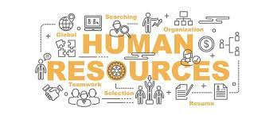

# HR_DEPARTEMENT_Dashboard_by_POWER_BI





---
## Introduction

This Power BI dashboard, titled "OTH-DATA-HR", provides a comprehensive analysis of employee data within an organization. The dashboard is designed to help HR teams make data-driven decisions by visualizing key metrics such as employee distribution, job satisfaction, attrition, gender ratios, and more. It includes interactive filters to allow for dynamic exploration of insights based on age group, marital status, job satisfaction, and gender.

The dashboard highlights crucial KPIs like total employees, total attrition, and monthly income, alongside in-depth analyses such as department-wise employee distribution, gender balance across job roles, and business travel frequency.

## Dashboard File

My final [dashboard](oth-data-hrr.pdf)

## Problem statement

1. How many employees does the organization currently have?
2. What is the employee turnover rate?
3. What is the gender distribution of employees?
4. What is the overall monthly payroll cost?
5. Which education fields exhibit higher job satisfaction levels?
6. Which departments have the highest number of employees? 
7. Which job roles exhibit gender disparity?
8. What is the travel frequency of employees?
9. What is the total Employees by Gender?
10. What is the demographic structure by age and gender? 


## Skills/ concepts demonstrated

- 🧮 Data Cleaning and Data Processing
- 📉 Charts and Visualization
- ❎ Conclusion and Recommendations

### 🧮 Data Cleaning and Dax :

- Total Employees ;
```sql
Total Employees = COUNT(HR_Analytics[EmpID])

```

### 📉 Charts and Visualization :

KPI's Requirements
1.	Total number of employees.
2.	Total number of employees who left the organization.
3.	Percentage of male and female employees
4.	Total monthly income for all employees.


The report comprises 6 charts:

___1. Total Employees by Job Satisfaction and Education Field;___


___2. Total Employees by Department;___


___3. Total Employees by Job Role and Gender;___


___4. Total Employees by Business Travel;___


___5. Total Employees by Gender;___


___6. Total Employees by Age Group and Gender;___


 the all dashboard 

___KPI's Requirements___


___1. Total Employees by Job Satisfaction and Education Field;___


__Objective:__ Identify key education fields to target for talent acquisition.  
__KPI Requirements:__
* Average job satisfaction by education field.
+ Correlation with other factors (e.g., income levels).  
___Observation:___ Job satisfaction is highest in the Life Sciences field.

___2. Total Employees by Department;___


__Objective:__ Effectively allocate human resources across departments.  
__KPI Requirements:__
* Number of employees per department.
* Growth or decline trends by department.  
___Observation:___ Most employees (64.93%) are in the Research & Development department..


___3. Total Employees by Job Role and Gender;___


__Objective:__ Promote diversity in underrepresented roles.  
__KPI Requirements:__
* Number of male and female employees by job role.
* Gender comparisons for similar roles.  
___Observation:___ Female representation is highest among Sales Executives (130 employees).


___4. Total Employees by Business Travel;___


__Objective:__ Optimize travel-related costs.  
__KPI Requirements:__
* Number of employees who travel rarely, frequently, or not at all.
* Average expenses associated with each travel category.  
___Observation:___ 998 employees travel rarely.


___5. Total Employees by Gender;___


__Objective:__ Provide insights into the organization's gender diversity.  
__KPI Requirements:__
* Total number of male and female employees.
* Percentage representation of each gender.
* Historical trends or comparisons if applicable.  
___Observation:___
* The organization has 60% male employees (854) and 40% female employees (569).
* This indicates a male-dominated workforce that may require strategies to improve female representation.


___6. Total Employees by Age Group and Gender;___


__Objective:__ Plan talent management based on age group trends.  
__KPI Requirements:__
* Distribution of employees by age group and gender.
* Historical trends in age-based recruitment.  
___Observation:___ The 26-35 age group is the most represented.


### ❎ Conclusion and Recommendations:

#### Conclusion

This dashboard provides a detailed analysis of key HR metrics, offering valuable insights into employee demographics, satisfaction, attrition, and workforce distribution. The data reveals notable trends, such as a male-dominated workforce (60%), a high concentration of employees in the Research & Development department (64.93%), and significant attrition (230 employees). While job satisfaction is relatively higher in the Life Sciences field, it varies widely across educational backgrounds. The dashboard also highlights business travel trends, with the majority of employees traveling rarely.

#### Recommendations

__Enhance Gender Diversity__

* Develop and implement gender-inclusive hiring and promotion policies.
* Introduce mentoring programs to support female employees in underrepresented roles.  

__Reduce Employee Attrition__

* Conduct exit interviews to identify common reasons for turnover.
* Offer career development opportunities, competitive benefits, and a supportive work environment to improve retention.  

__Optimize Job Satisfaction__

* Address the disparities in job satisfaction among employees from different education fields.
* Regularly conduct employee satisfaction surveys to monitor and act on feedback.  

__Improve Workforce Balance__

* Reassess resource distribution in departments with lower employee representation (e.g., Sales and Human Resources).
* Provide targeted training programs to upskill employees in smaller departments.  

__Optimize Business Travel Expenses__

* Review travel policies to ensure cost-effectiveness while meeting business needs.
* Consider leveraging virtual meetings for employees traveling frequently.  

__Leverage Data-Driven Decision-Making__

* Use predictive analytics to identify future HR trends and challenges, such as attrition risk or workforce aging.
* Continuously monitor KPIs on the dashboard to adapt strategies as needed.  
