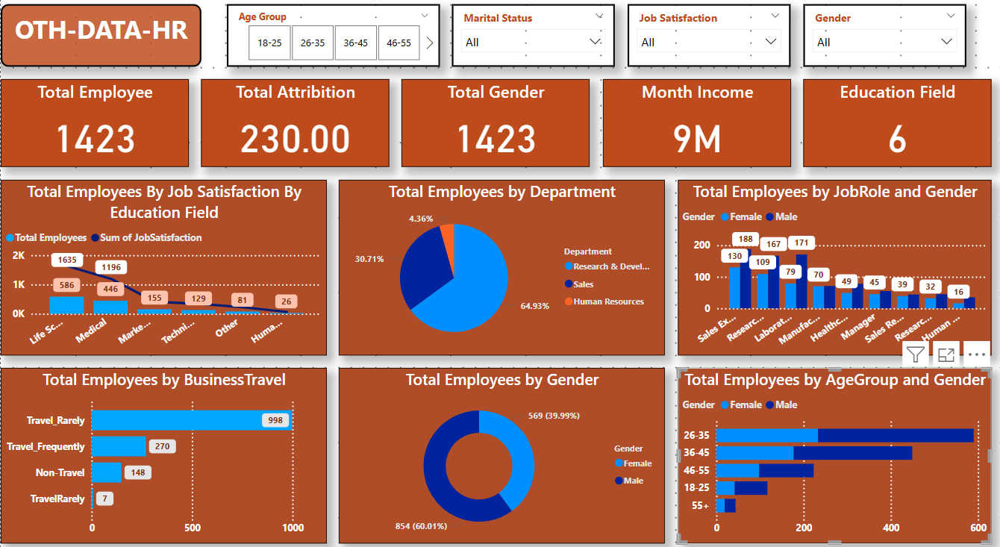
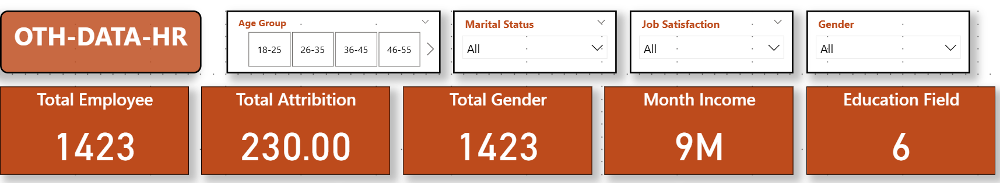
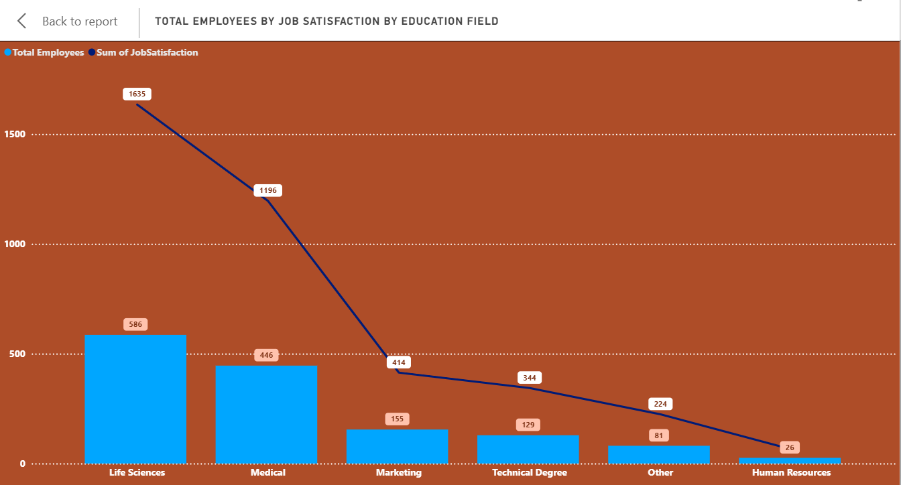
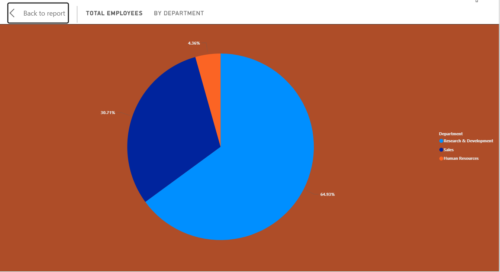
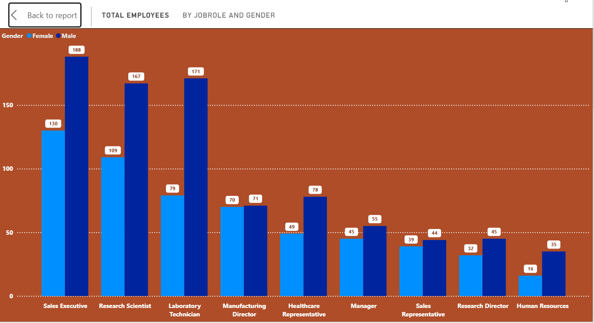
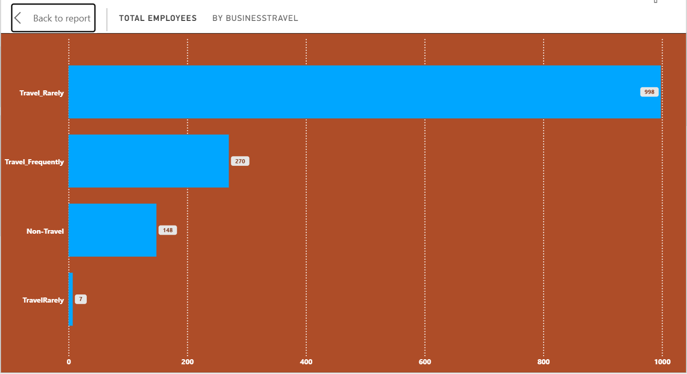
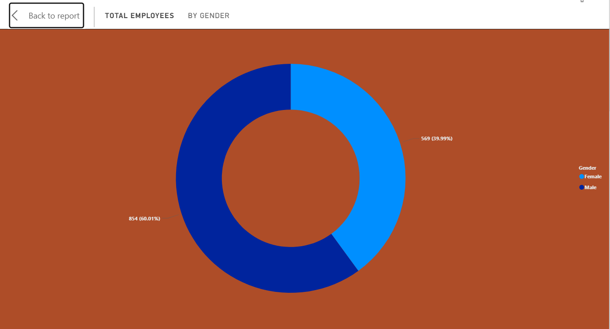
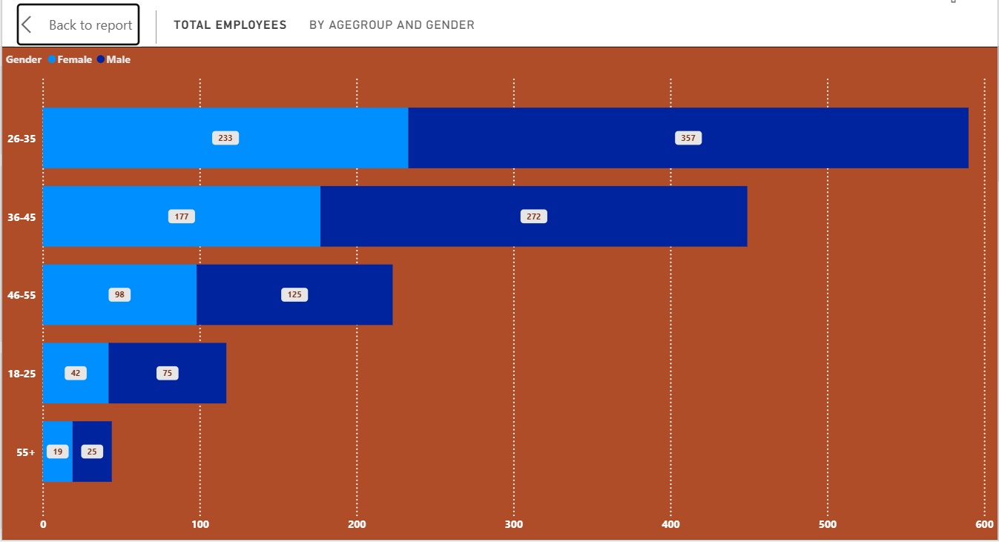

# HR_DEPARTEMENT_Dashboard_by_POWER_BI


---
## Introduction

This Power BI dashboard, titled "OTH-DATA-HR", provides a comprehensive analysis of employee data within an organization. The dashboard is designed to help HR teams make data-driven decisions by visualizing key metrics such as employee distribution, job satisfaction, attrition, gender ratios, and more. It includes interactive filters to allow for dynamic exploration of insights based on age group, marital status, job satisfaction, and gender.

The dashboard highlights crucial KPIs like total employees, total attrition, and monthly income, alongside in-depth analyses such as department-wise employee distribution, gender balance across job roles, and business travel frequency.

## Dashboard File

My final [dashboard](oth-data-hrr.pdf)

## Problem statement

1. How many employees does the organization currently have?
2. What is the employee turnover rate?
3. What is the gender distribution of employees?
4. What is the overall monthly payroll cost?
5. Which education fields exhibit higher job satisfaction levels?
6. Which departments have the highest number of employees? 
7. Which job roles exhibit gender disparity?
8. What is the travel frequency of employees?
9. What is the total Employees by Gender?
10. What is the demographic structure by age and gender? 

## Skills/ concepts demonstrated

- 🧮 Data Cleaning and Data Processing
- 📉 Charts and Visualization
- ❎ Conclusion and Recommendations

### 🧮 Data Cleaning and Dax :

- Total Employees ;
```sql
Total Employees = COUNT(HR_Analytics[EmpID])

```

### 📉 Charts and Visualization :

KPI's Requirements
1.	Total number of employees.
2.	Total number of employees who left the organization.
3.	Percentage of male and female employees
4.	Total monthly income for all employees.


The report comprises 6 charts:

___1. Total Employees by Job Satisfaction and Education Field;___


___2. Total Employees by Department;___


___3. Total Employees by Job Role and Gender;___


___4. Total Employees by Business Travel;___


___5. Total Employees by Gender;___


___6. Total Employees by Age Group and Gender;___


 the all dashboard 

___KPI's Requirements___



___1. Total Employees by Job Satisfaction and Education Field;___



___2. Total Employees by Department;___




___3. Total Employees by Job Role and Gender;___




___4. Total Employees by Business Travel;___




___5. Total Employees by Gender;___




___6. Total Employees by Age Group and Gender;___




### ❎ Conclusion and Recommendations:

___Product Strategy:___ Focus on stocking and promoting high-performing item types identified in the analysis to maximize sales.


___Inventory Management:___ Align inventory distribution with regional preferences, especially concerning product attributes like fat content, to meet customer demand effectively.


___Outlet Development:___ Consider insights on outlet size, location, and type when planning new stores or refurbishing existing ones to optimize sales performance.


___Marketing Initiatives:___ Tailor marketing campaigns to highlight popular products and cater to regional tastes, as indicated by the sales data.


By implementing these recommendations, OTH-DATA Clothing Store can enhance its sales performance, improve customer satisfaction, and strategically plan for future growth.
